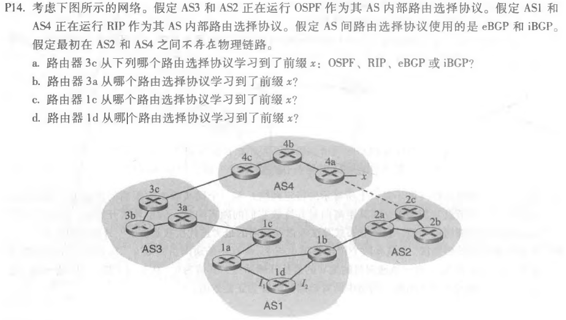
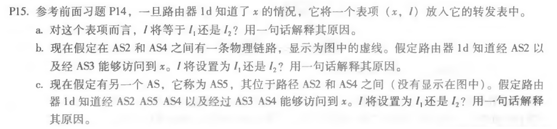
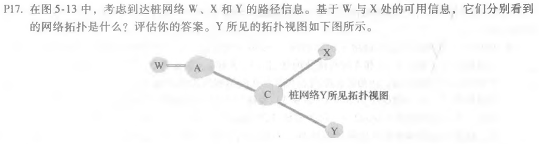
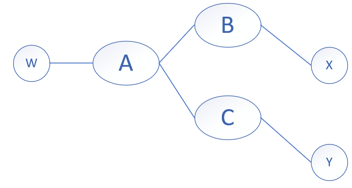
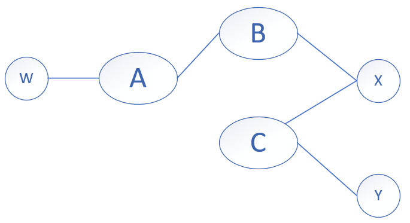

###### 2017301530080 王润泽

---

a. eBGP

b. iBGP

c. eBGP

d. iBGP

---

a.  $I$ 将被设置为 $I_1$，因为1d的可达性信息来源于1c,而$I_1$离1c最近。

b.  $I$ 将被设置为 $I_2$,因为1d有两条路径可达x，分别是(AS3,AS4,x)和(AS2,AS4 ,x)，AS-Path相等，根据热土豆路由选择，(AS2,AS4,x)，1d通过iBGP知道可以通过1c和1b到达x，选择最低域内开销的本地网关1b，所以选择$I_2$。

c. $I$ 将被设置为 $I_1$，因为1d有两条路径可达x，分别是(AS3,AS4,x)和(AS2,AS5,AS4 ,x)，AS-PATH不相等，其中(AS3,AS4,x)最短，所以选择$I_1$。

---

W所见：X所见：

