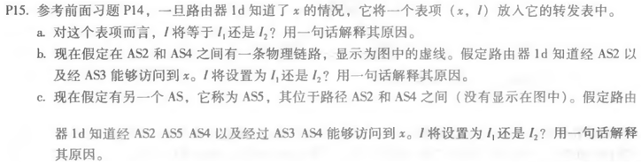
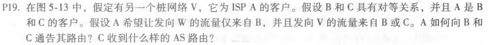
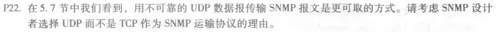

### 第十次作业

* * *

#### P15

##### 题目：

##### 作答：
a. I等于I1，因为这个是从1d到1c的最小开销路径。

b. I等于I2。虽然这两种路由都有相等的AS-PATH路径⻓度，但I2开始的路径到下一个路由器更近。

c. I等于I1，因为指向I1的路径AS-PATH路径⻓度更短。

* * *

#### P19

##### 题目：

##### 作答：
A会通告B两条路由，A-W和A-V。

A会通告C一条路由，A-V。

C收到的AS路由：B-A-W、B-A-V、A-V。

* * *

#### P22

##### 题目：

##### 作答：
在TCP上运⾏SNMP时，TCP的拥塞控制将导致SNMP在⽹络管理器需要发送SNMP消息时，却退出并停⽌发送消息，导致SNMP没有发挥作用。

* * *
