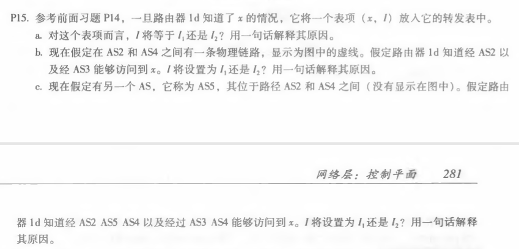
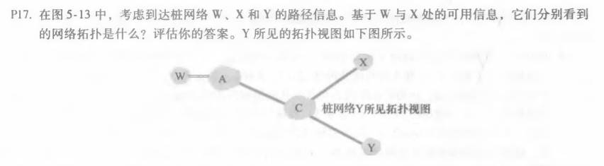
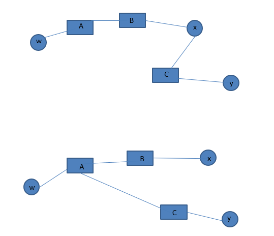
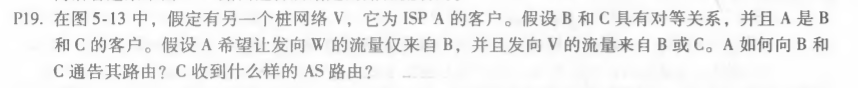

# homework10

#### 计算机网络（自顶向下）中文版第五章练习（电子版p297起，纸质版p279起）

###### 1，p15

a.对于这个表项，I=I1,因为这个接口开始从1d到网关路由1c为最低成本路径。

b.I2,这两种路由具有相等的路径长度，但I2开始的路径有最近路由。

c.I1，I1开始有最短路径。

###### 2，p17

w和x分别可看到的网络拓扑如下所示：

X不知道AC链路，因为X没有接收到包含AC链路的w或y的⼴告路由.

###### 2，p19

答：A向B通告A-W和A-V；A向C通告A-V；C作为路径接收：B-A-W,B-A-V,A-V。