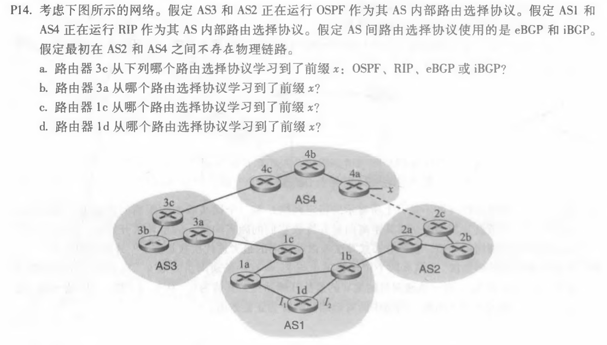
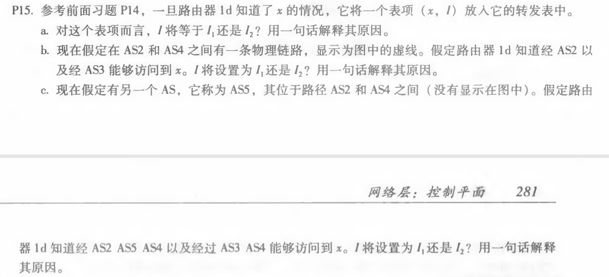
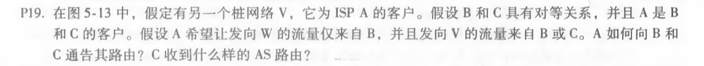

# 网络及分布式计算第十次作业

计算机学院-刁可 -2017302580031

1. P14

   

   a. eBGP

   b. iBGP

   c. eBGP

   d. iBGP

2. P15

   

   a. I = I1,因为这样距离1c最近,从1d到1c是最低成本路径。
   b. I2，根据热土豆路由选择，这两种路由都有相等的路径长度，但I2开始的路径有最近的下一路由器。
   c). 设置为I1，这样开始具有最短路径。

3. P19

   

   A应该通告B两条路线，A-W和A-V。

   A应该通告C一条路线，A-V。

   C收到的AS路由：B-A-W、B-A-V、A-V。