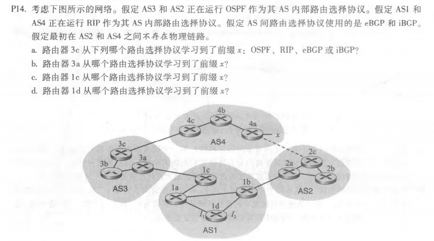
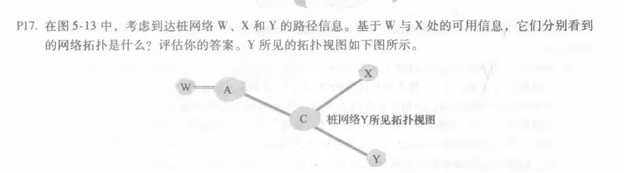
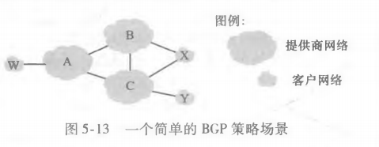
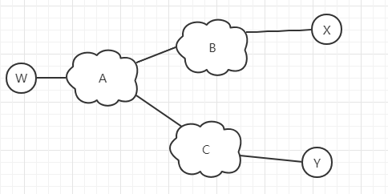
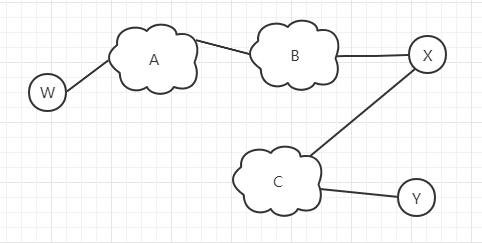

### Chapter5 (p14, p15, p17)

******

- a. eBGP

- b. iBGP

- c. eBGP

- d. iBGP

******

- a. I1，因为1d到1c的最低成本路径是从 I1出发的

- b. I2，虽然两个路由路径的长度相同，但是下一跳最近的路由器在AS2

- c. I1，因为路径从 I1出发可以使得AS路径最短

******

- W所见的拓扑图视图：

  

- X所见的拓扑图视图：

