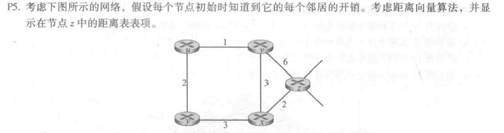
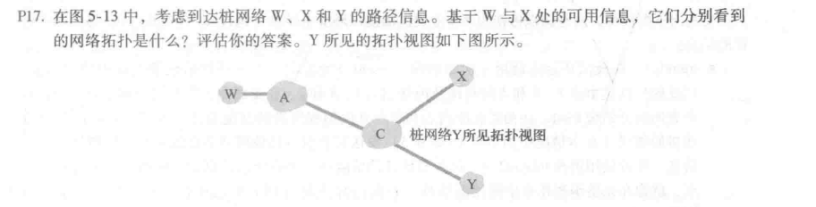
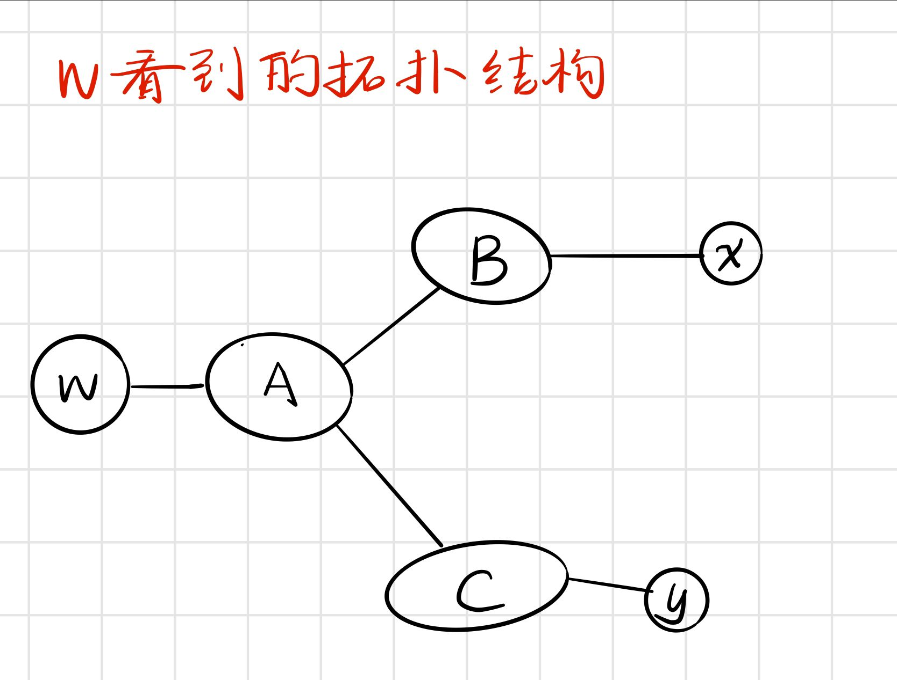
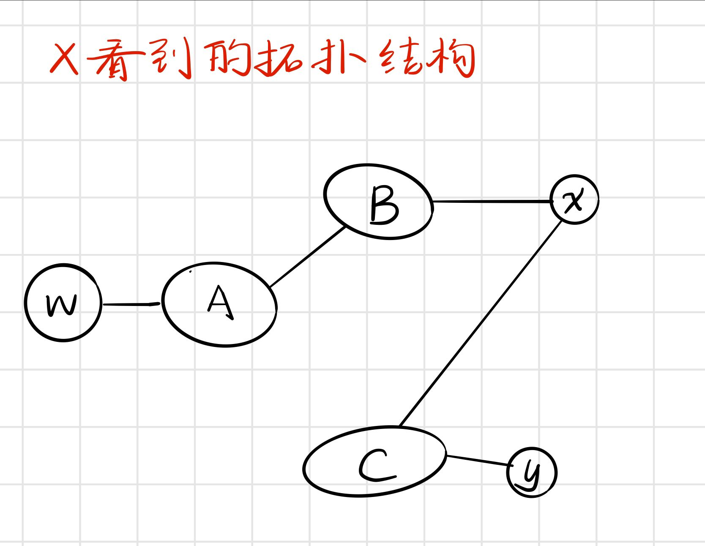
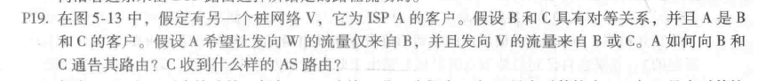

# 第次作业

Author：陈俊杰

StuNo:  2017302580109

选取第五章——网络层：控制平面的3道习题：

- P5

   

   >本题主要距离向量算法——动态规划。
   >
   >解答：
   >
   >|      | u        | v        | x        | y        | z        |
   >| ---- | -------- | -------- | -------- | -------- | -------- |
   >| v    | $\infty$ | $\infty$ | $\infty$ | $\infty$ | $\infty$ |
   >| x    | $\infty$ | $\infty$ | $\infty$ | $\infty$ | $\infty$ |
   >| z    | $\infty$ | 6        | 2        | $\infty$ | 0        |
   >
   >|      | u        | v    | x    | y        | z    |
   >| ---- | -------- | ---- | ---- | -------- | ---- |
   >| v    | 1        | 0    | 3    | $\infty$ | 6    |
   >| x    | $\infty$ | 3    | 0    | 3        | 2    |
   >| z    | 7        | 5    | 2    | 5        | 0    |
   >
   >|      | u    | v    | x    | y    | z    |
   >| ---- | ---- | ---- | ---- | ---- | ---- |
   >| v    | 1    | 0    | 3    | 3    | 5    |
   >| x    | 4    | 3    | 0    | 3    | 2    |
   >| z    | 6    | 5    | 2    | 5    | 0    |
   >
   >|      | u    | v    | x    | y    | z    |
   >| ---- | ---- | ---- | ---- | ---- | ---- |
   >| v    | 1    | 0    | 3    | 3    | 5    |
   >| x    | 4    | 3    | 0    | 3    | 2    |
   >| z    | 6    | 5    | 2    | 5    | 0    |

- P17

  >
  >
  >**解答：**
  >
  >+ 基于**W**处的信息，看到的网络拓扑结构：
  >
  >  
  >
  >+ 基于**X**处的信息，看到的网络拓扑结构：
  >
  >  
  >
  >产生这种结果的原因是：通往目标的路径上，X没有收到同时包含AS A和AS C的通告，也就是说X对AC链路一无所知。

- P19

  >
  >
  >**解答：**
  >
  >A应该通告B两条路线，A-W和A-V
  >
  >而向C通告一条路线，A-V
  >
  >C收到的AS路由：B-A-W、B-A-V、A-V

