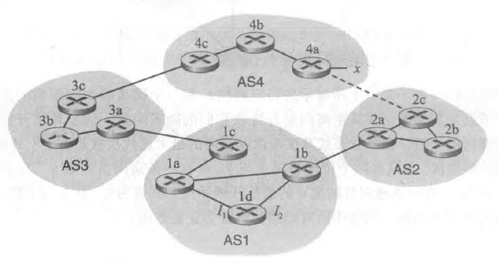

> P12. 描述在BGP中是如何检测路径中的环路的。

答：由于在BGP循环中从AS到⽬的地都提供了完整的路径信息检测，如果BGP对等体接收到包含⾃⼰的AS号的路由AS路径，然后使⽤该路由将导致环路。

> P13. BGP路由器将总是选择具有最短AS路径长度的无环路由吗？评估你的答案。

答：选择的路径不⼀定是最短的路径。因为在路线选择过程中有许多问题需要考虑，由于经济原因，较⻓的⽆环路路径很可能⽐较短的⽆环路路径更可取。

> P14. 考虑下图所示的网络。假定AS3和AS2正在运行OSPF作为其AS内部路由选择协议。假定AS1和 AS4正在运行RIP作为其AS内部路由选择协议。假定AS间路由选择协议使用的是eBGP和iBGP。 假定最初在AS2和AS4之间不存在物理链路。

>   a. 路由器3c从下列哪个路由选择协议学习到了前缀心OSPF、RIP, eBGP或iBGP?

答：eBGP

>  b. 路由器3a从哪个路由选择协议学习到了前缀x?

答：iBGP

>  c. 路由器lc从哪个路由选择协议学习到了前缀x?

答：eBGP

>  d. 路由器Id从哪个路由选择协议学习到了前缀x?

答：iBGP
