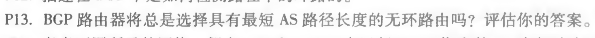
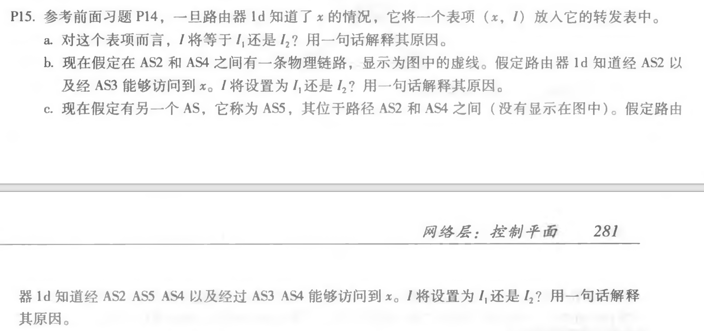
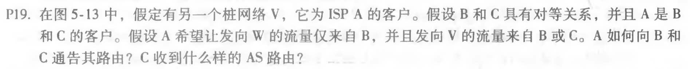

## 第十次作业

------

### 1. P13

不一定这样选择。在路径的选择过程中，有许多的影响因素。在考虑经济开销的情况下，较长的无环路经很可能比较短的有环路经更可取。

------

### 2. P15

a. I1，因为从1d到1c的最低成本路径是从I1出发的。

b. I2，虽然这两种路由路径长度相等，但从I2开始的路径有最近的下一跳路由器。

c. I1，因为从I1出发有最短路径。

------

### 3. P19

A向B的通告：A-W, A-V

A向C的通告：A-V

C的接收：B-A-W, B-A-V, A-V