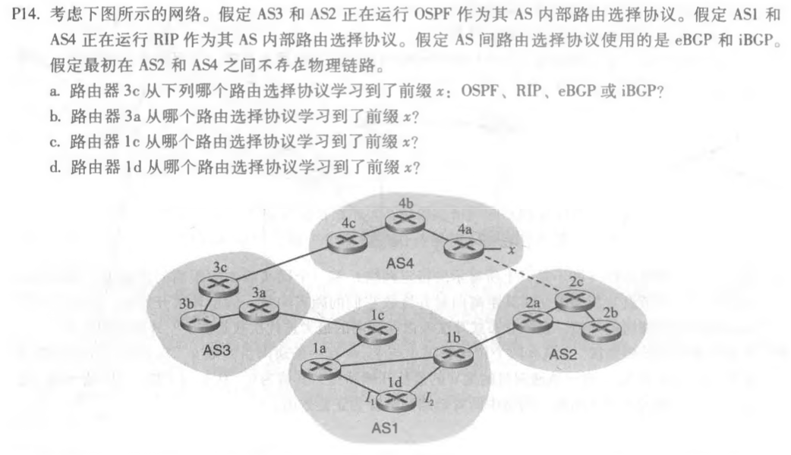
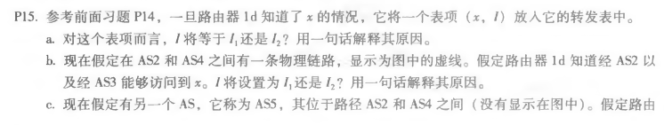
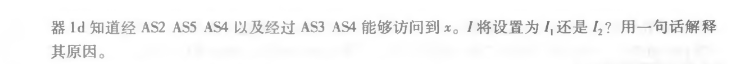
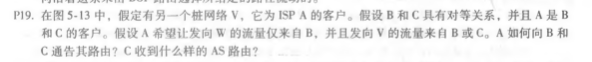

## P14

a. eBGP

b. iBGP

c. eBGP

d. iBGP

## P15

a. I~1~，因为这个接口开始从1D到网关路由器1c的路径成本最低
b. I~2~，这两种路由都有相等的路径长度，但I~2~开始的路径有最低域内开销的本地网关
c. I~1~，I1开始具有最短路径的路径

## P19

A向B：A-W和A-V

A向C： A-V

C作为路径接收: B-A-W、B-A-V、A-V