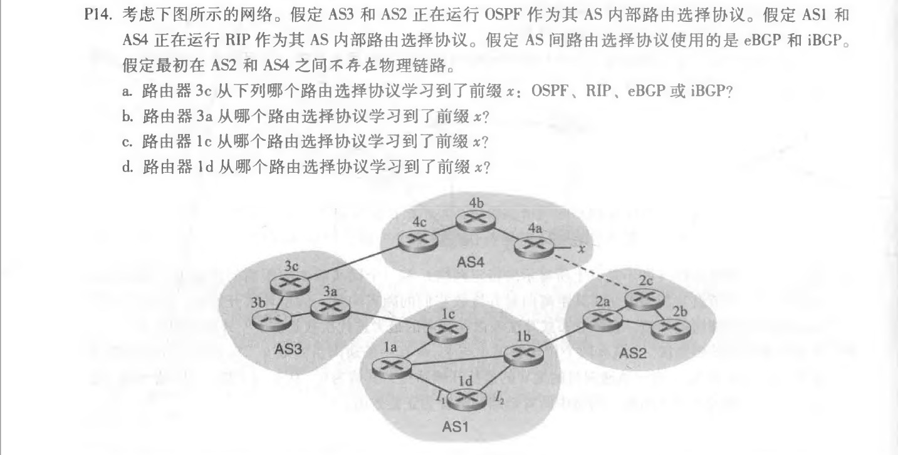
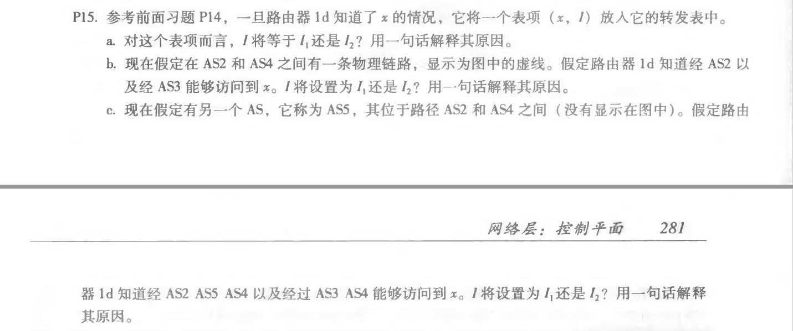

## Homework_10

**Author：**

姓名： 王泽生

学号：2017302580268

第五章习题：**P14、P15、P16**

### P14

**解答：**

a）eBGP

b）iBGP

c）eBGP

d）iBGP

### P15

**解答：**

a）$I_1$ ，因为这个接口开始从1d到网关路由器1c的最短路径

b）$I_2$ ，两种路由具有相同的 AS-PATH 长度，但是 $I_2$ 开始的路径具有最近的 NEXT-HOP 路由器

c）$I_1$ ，$I_1$ 开始的路径具有最短的 AS-PATH

### P16

**解答：**

C 仅通过它的东海岸对等点传播到 D 的路由

