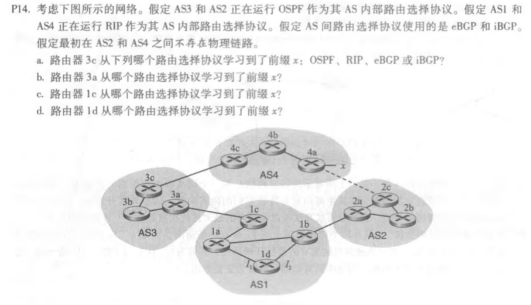
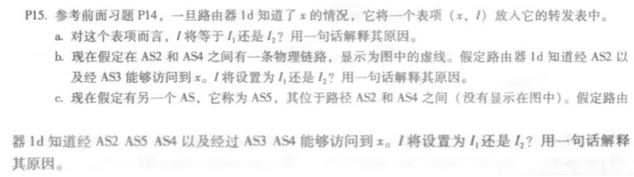
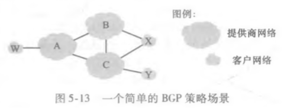
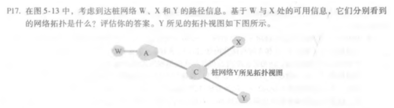
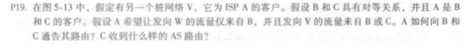
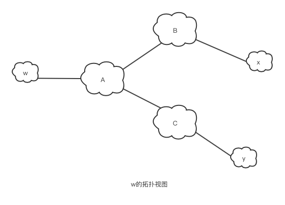

## 课后题

### P14

a. eBGP

b. iBGP

c.eBGP

d. iBGP

### P15

a. I将等于I1，因为AS1采用RIP路由选择协议，RIP协议基于距离矢量算法，根据跳数来衡量到目标地址的距离，这里通过I1有2跳，通过I2有3跳，所以 I将等于I1。

b. I将等于I2,因为两条路径通过的AS-PATH的长度相等，而I2到NEXT-HOP路由器（1b）的距离小于I1到NEXT-HOP路由器（1c），所以I将等于I2。

c. I将等于I1，因为I1相比I2有更短的AS-PATH

### P17、19

17.

19. A通告B路由路径AW、AV；A通告C路由路径AV；C收到的AS路由是BAW、BAV、AV

