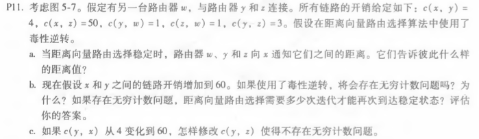

## *第十次作业*

---------------------------------------------  
### 第五章课后习题任选三题  
#### P11

##### 答：  
a.  
  w，通知y:Dw(x)=∞，通知z:Dw(x)=5。  
  y，通知w:Dy(x)=4，通知z:Dy(x)=4。  
  z，通知w:Dz(x)=∞，通知y:Dz(x)=6。  
b.   
会存在无穷计数问题，因为w,y,z三个节点形成环路，计算开销产生循环。需要经过31次迭代才能达到稳定状态。  
c.  
将c(y,z)修改为∞则不发生无穷计数问题，即切断y与z之间的链路。

#### P14   

##### 答：  
a.  
路由器3c向AS4中4c路由器发送eBGP。  
b.  
路由器3a向AS3中其他路由器发送iBGP。  
c.  
路由器1c向AS3中3a路由器发送eBGP报文。  
d.  
路由器1d向AS1中其他路由器发送iBGP报文。

#### P15  

##### 答：  
a.  
I等于I1，理由：1d通过I1学习前缀x的开销较低。  
b.  
I设置为I2，理由：通过I1和I2的AS-PATH长度相同，但通过I2时经过链路数少、开销较低。  
c.  
I设置为I1，理由：通过I1时具有最短的AS-PATH。

