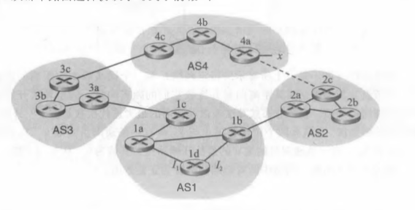
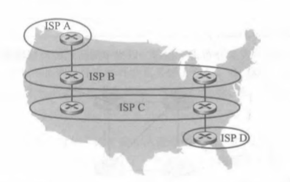

# HOMEWORK10

2017302580288  李沛昊

## P14

**问题：**考虑下图所示的网络。假定AS3和AS2正在运行OSPF作为其AS内部路由选择协议。假定AS1和 AS4正在运行RIP作为其AS内部路由选择协议。假定AS间路由选择协议使用的是eBGP和iBGP。 假定最初在AS2和AS4之间不存在物理链路。

a 路由器3c从下列哪个路由选择协议学习到了前缀$x$:OSPF、RIP, eBGP或iBGP?

b 路由器3a从哪个路由选择协议学习到了前缀x?

c 路由器lc从哪个路由选择协议学习到了前缀x

d路由器Id从哪个路由选择协议学习到了前缀x? 

**解答：**

a.eBGP

b.iBGP

c.eBGP

d.iBGP

## P15

**问题：**参考前面习题P14, —旦路由器Id知道了x的情况，它将一个表项(x，I)放入它的转发表中。

 a.对这个表项而言，$I$将等于$I_{1}$还是$I_{2}$？用一句话解释其原因。

 b.现在假定在AS2和AS4之间有一条物理链路，显示为图中的虚线。假定路由器Id知道经AS2以 及经AS3能够访问到x。$I$将设置为$I_{1}$还是$I_{2}$？用一句话解释其原因 。 

C.现在假定有另一个AS,它称为AS5,其位于路径AS2和AS4之间(没有显示在图中)。假定路由
器Id知道经AS2 AS5 AS4以及经过AS3 AS4能够访问到x。$I$将设置为$I_{1}$还是$I_{2}$？用一句话解释 其原因。

**解答：**

a.因为一开始AS2和AS4中间不存在物理链路，所以通向x的路径要经过1c，所以$I=I_{1}$,是1d通向网关1c最短的路径

b.$I=I_{2}$,因为从AS4到AS1的两条转发路径AS-PATH都为2，而从$I_{2}$出发有着最小的NEXT-HOP路由开销。

c..$I=I_{1}$,因为从AS4  AS3 AS1的AS-PATH比AS4 AS5 AS2 AS1少，所以选择网关1c，从$I_{1}$通向NEXT-HOP1c的开销最小。

## P16

**问题：**考虑下面的网络。ISP B为地区ISP A提供国家级主干服务。ISPC为地区ISP D提供国家级主干服 务。每个ISP由一个AS组成。B和C使用BGP,在两个地方互相对等。考虑从A到D的流量。B 愿意将流量交给C传给西海岸（使得C将承担承载跨越整个国家的流量开销），而C愿意经其东海 岸与B对等的站点得到这些流量（使得B将承载跨越整个国家的流量）。C可能会使用什么样的 BGP机制，使得B将通过东海岸对等点传递A到D的流量？要回答这个问题，你需要钻研BGP  规范。

**解答：**

ISP C可以只通告经过C的供海岸前往ISP D的路径就可以迫使ISP B通过东海岸转发流量。