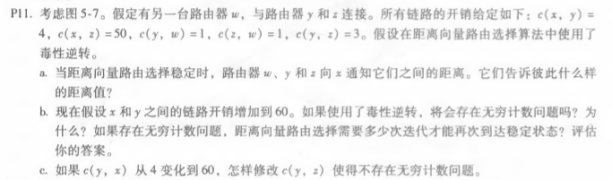
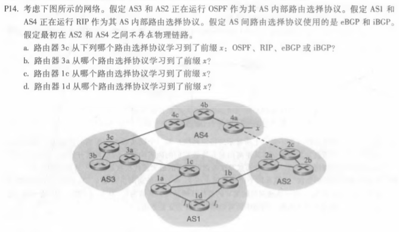

## P11
                
a.
<table>
<tr> <td>w</td> <td> 通知y：Dw(x)=∞ 
                     通知z：Dw(x)=5 </td> </tr>
<tr> <td>y</td> <td> 通知w：Dy(x)=4 
                     通知z：Dy(x)=4 </td> </tr>
<tr> <td>z</td> <td> 通知w：Dz(x)=∞ 
                     通知y：Dz(x)=6 </td> </tr>
</table>
b.会存在无穷大的问题。w，y，z在计算路由器x的开销时会形成一个循环。在第30次迭代时达到稳定状态。 
c.直接切断y，z之间的连接。

## P12
    

在BGP循环中从AS到目的地都提供了完整的路径信息检测，如果BGP对等体接收到包含自己的AS号的路由AS路径，使用该路由将导致环路。

## P14
    
a. eBGP     
b. iBGP     
c. eBGP    
d. iBGP       

 

 
刘涛 2017302580292 2020.05.21
