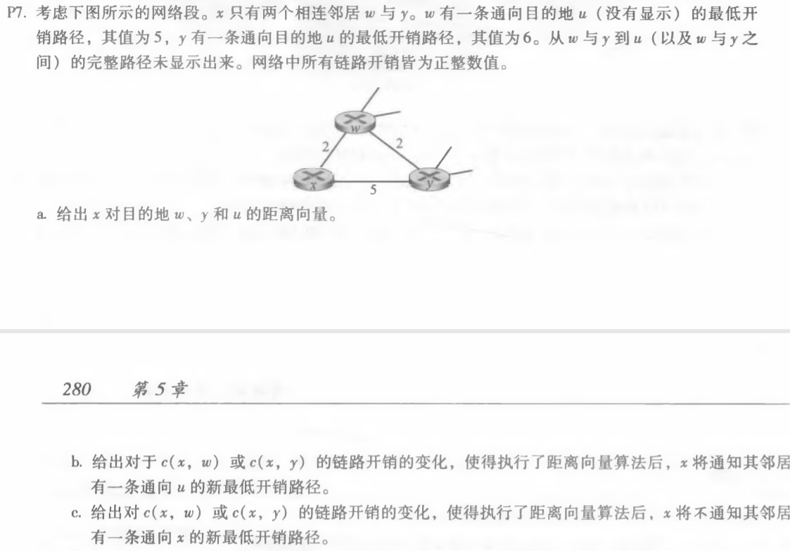
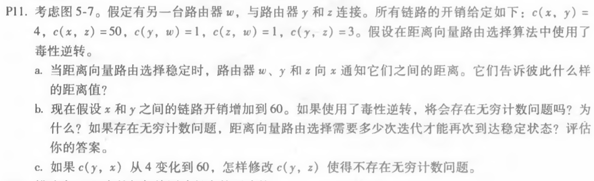
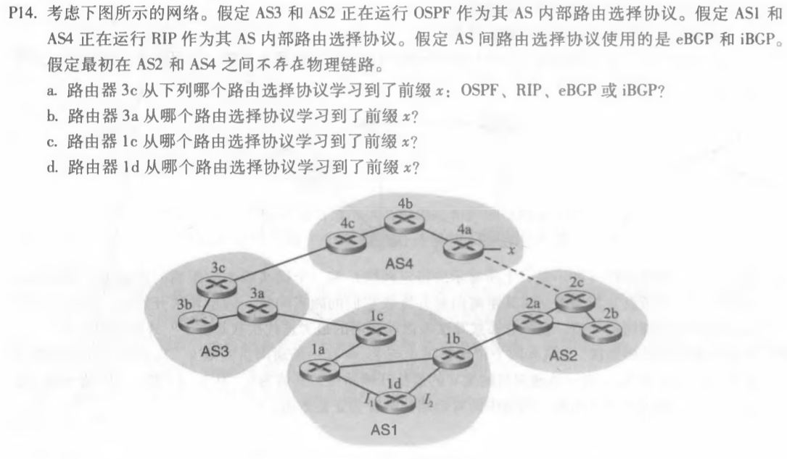

#### 1. P7

a. Dx(w) = 2, Dx(y) = 4, Dx(u) = 2 + 5 = 7

b. 当前x通向u的最低开销路径为xwu, 最小开销为7。

当c(x,w)的链路开销变化时，当c(x,w) > 6时，x通向u的最低开销路径将变为xyu。

当c(x,y)的链路开销变化时，当c(x,y)<1时，x通向u的最低开销路径将变为xyu。

c. 当前x的邻居通向x的最低开销路径分别为Dw(x) = 2, Dy(x) = 4

当c(x,w)的链路开销变化时，当c(x,w) < 7，w通向x的最低开销路径仍为wx；当c(x,w) < 3，y通向x的最低开销路径仍为ywx。

当c(x,y)的链路开销变化时，无论c(x,y)如何改变，w通向x的最低开销路径仍为wx；当c(x,y) > 4，y通向x的最低开销路径仍为ywx。

#### 2. P11

a. 对于路由器y，通知w：Dy(x) = 4；通知z：Dy(x) = 4

对于路由器z，通知w：Dz(x) = 正无穷；通知y：Dz(x) = 6

对于路由器w，通知y：Dw(x) = 5；通知z：Dw(x) = 正无穷

b. 当x和y之间的链路开销增加到60时，会存在无穷计数的问题。因为这里涉及到了3个节点的环路，无法使用反向下毒检测。需要经过31次迭代，距离向量路由选择再次达到稳定状态。因为此时x到y的最低开销路径为xzwy，路径大小为52，且不会再发生改变。

c. 当c(y, x)从4变为60时，应该将c(y,z)修改为正无穷大时不会发生无穷计数问题，此时y与z之间的链路被切断。

#### 3. P14

a. 3c向AS4中4c路由器发送eBGP报文，从中学习到前缀x

b. 3a向AS3中其他路由器发送iBGP报文，从中学习到前缀x

c. 1c向AS3中3a路由器发送eBGP报文，从中学习到前缀x

d. 1d向AS1中其他路由器发送iBGP报文，从中学习到前缀x