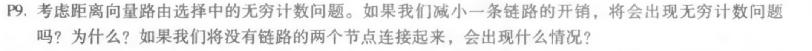
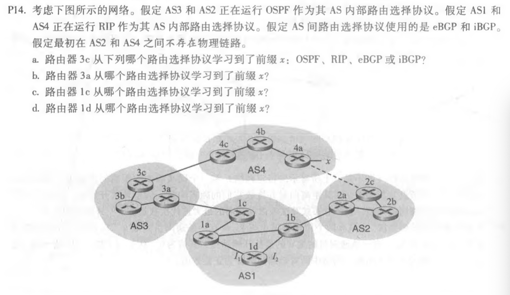
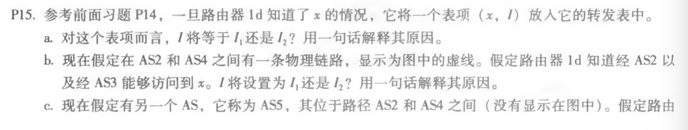

# # 第十次作业
## 第五章课后习题任选3题
### P9

#### 答：
不会，因为降低的链接成本不会引起循环（由该链接的两个节点之间的下一跳关系引起）。会出现将链接权重从无限减小为有限权重。

### P14

#### 答：
1. eBGP
2.  iBGP
3. eBGP
4.  iBGP

### P15

#### 答：
1. I1：此接口开始了从1d到网关路由器1c的成本最低的路径
2. I2：两条路由的AS-PATH长度均相等，但是I2开始具有最接近的NEXT-HOP路由器的路径。
3. I1： I1开始具有最短AS-PATH的路径。
